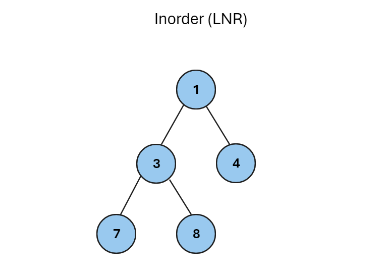
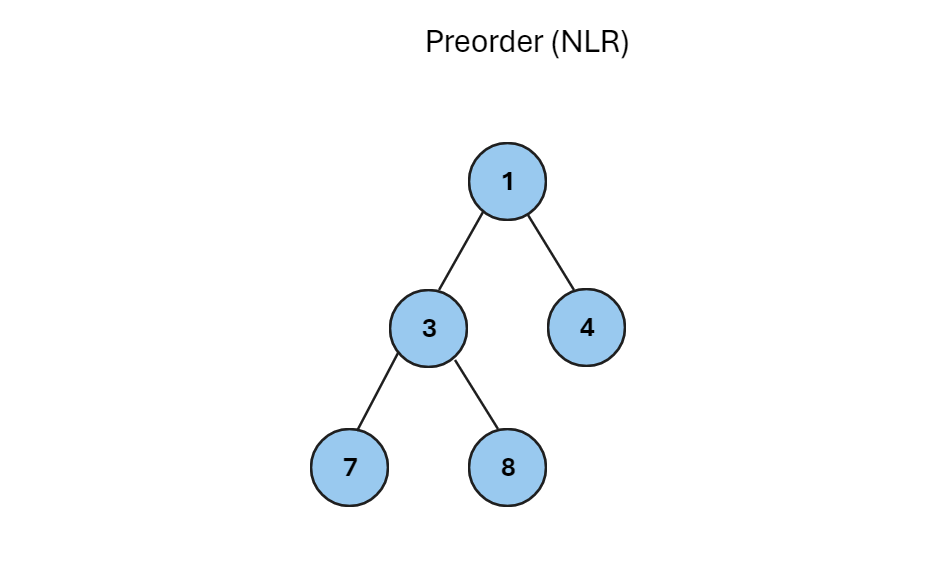
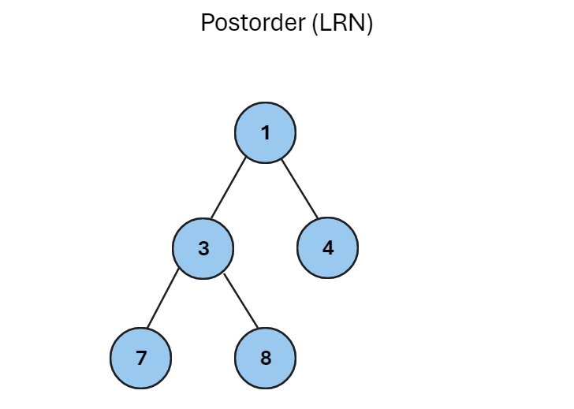

<strong><h1>Types of tree navigation</h1></strong>

<ol>
<li>Depth First Scan (DFS)</li>
    <ol>
        <li>Inorder (LNR)</li>
        <li>Preorder (NLR)</li>
        <li>Postorder (LRN)</li>
    </ol>
</ol>

<strong><h1>Inorder Navigation (LNR)</h1></strong>

In this navigation method, the left subtree and thus the node is visited first and then the right subtree

<strong>Notes: &#xe002;</strong>

<pre>
    if one binary tree is a subtree,
    respectivly navigation inorder,
    outputs sorted key value generated ascending respectivly
</pre>

<ol>
<li>Steps for navigation tree:</li>
    <ol>
        <li>Navigate recursively down the left tree</li>
        <li>The root node has been visited</li>
        <li>Navigate recursively down the right tree</li>
    </ol>
</ol>

<h4>for example consider the following subtree</h4>

<pre>
    Start from 1 and move it under the left tree with " <strong>LNR</strong> " navigation.
    this process go an when visited the all nodes,
    output this navigation inorder "<strong>LNR</strong>" the following expressions
</pre>

<code>
    7 -> 3 -> 8 -> 1 -> 4
</code>

<a href="[https://github.com/mohammadAitech/LNR-LRN-NLR_Trees_in_c-/LNR.cpp](https://github.com/mohammadAitech/LNR-LRN-NLR_Trees_in_c-/blob/main/LNR/LNR/LNR/LNR.cpp)">LNR Tree in cpp</a>

<strong><h1>Preorder Navigation (NLR)</h1></strong>

In this navigation method, first the root of the node is visited, then the subtree on the left and finally the subtree on the right.

<ol>
<li>Steps for navigation tree:</li>
    <ol>
        <li>The root node has been visited</li>
        <li>Navigate recursively down the left tree</li>
        <li>Navigate recursively down the right tree</li>
    </ol>
</ol>

<h4>for example consider the following subtree</h4>

<pre>
    We will start from and visit ourselves first by navigating in advance " <strong>NLR</strong> " navigation.
    this process go an when visited the all nodes,
    output this navigation inorder "<strong>NLR</strong>" the following expressions
</pre>

<code>
    1 -> 3 -> 7 -> 8 -> 4
</code>

<a href="[https://github.com/mohammadAitech/LNR-LRN-NLR_Trees_in_c-/LNR.cpp](https://github.com/mohammadAitech/LNR-LRN-NLR_Trees_in_c-/blob/main/NLR/NLR/NLR/NLR.cpp)">NLR Tree in cpp</a>

<strong><h1>Postorder Navigation (LRN)</h1></strong>

In this navigation method, as the name suggests, it is visited at the end. First, we navigate under the left tree, then under the right tree, and finally the root node

<ol>
<li>Steps for navigation tree:</li>
    <ol>
        <li>Navigate recursively down the left tree</li>
        <li>Navigate recursively down the right tree</li>
        <li>The root node has been visited</li>
    </ol>
</ol>

<h4>for example consider the following subtree</h4>

<pre>
    We start from 1 and after traversing the order, we first visit the subtree on the left, which is 3. 3 is also traversed in reverse order " <strong>LRN</strong> " navigation.
    this process go an when visited the all nodes,
    output this navigation inorder "<strong>LRN</strong>" the following expressions
</pre>

<code>
    7 -> 8 -> 3 -> 4 -> 1
</code>

<a href="[https://github.com/mohammadAitech/LNR-LRN-NLR_Trees_in_c-/LNR.cpp](https://github.com/mohammadAitech/LNR-LRN-NLR_Trees_in_c-/blob/main/LRN/LRN/LRN/LRN.cpp)">LRN Tree in cpp</a>
